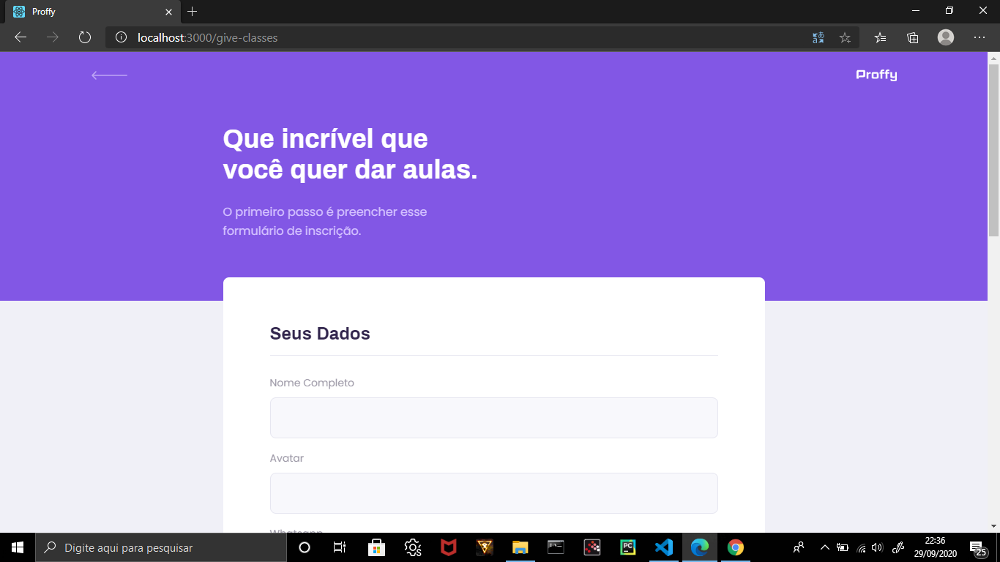
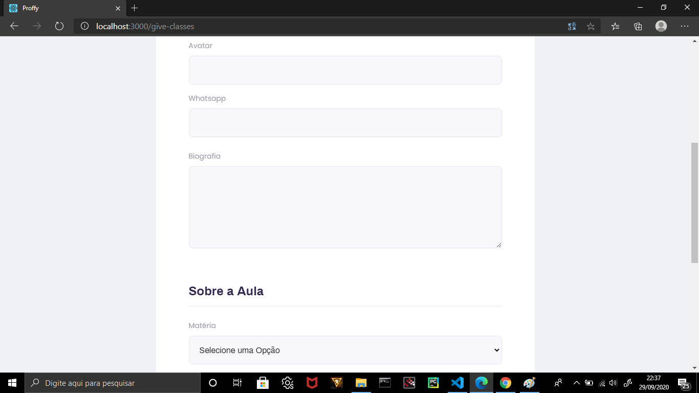
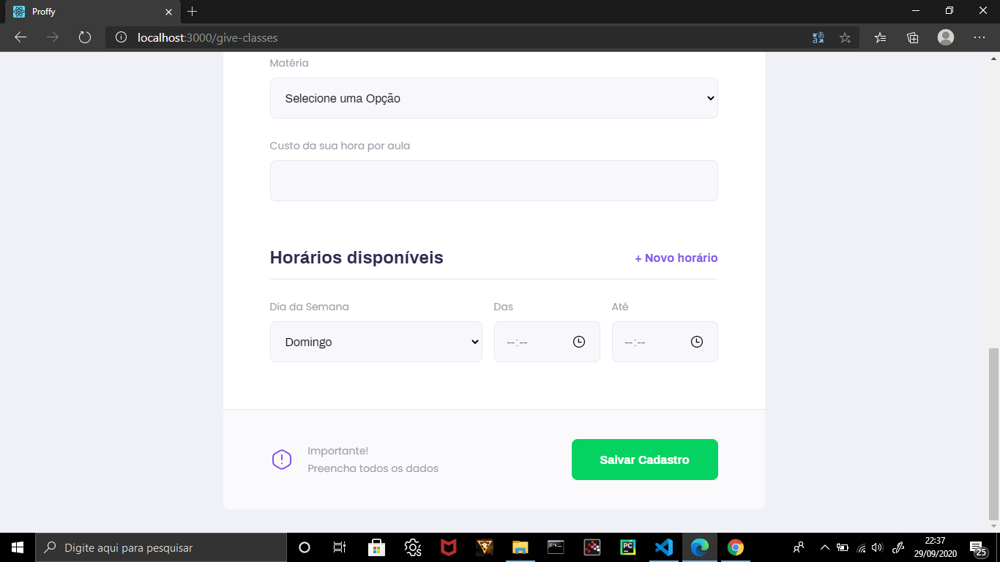
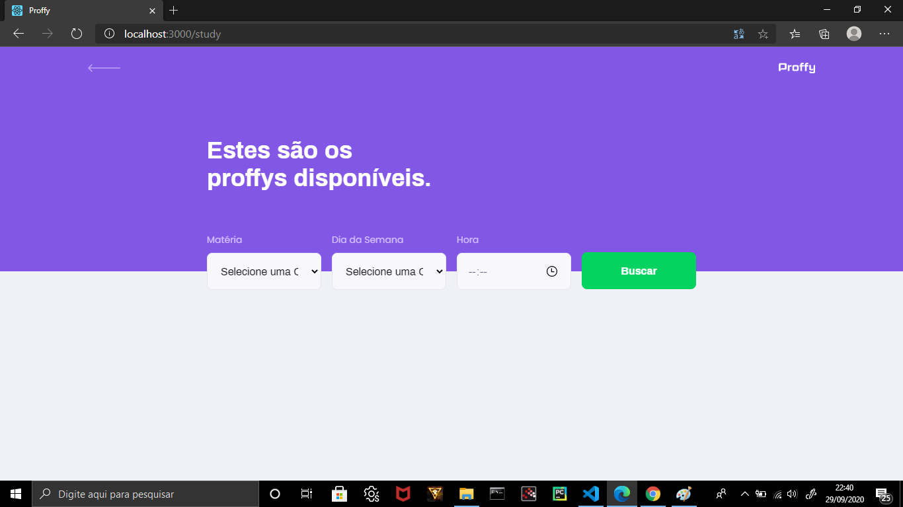
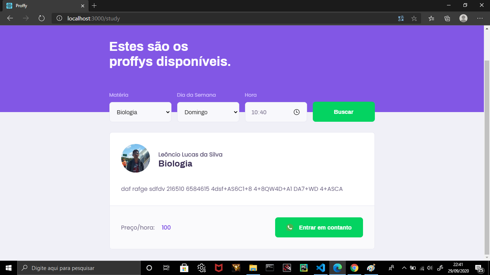
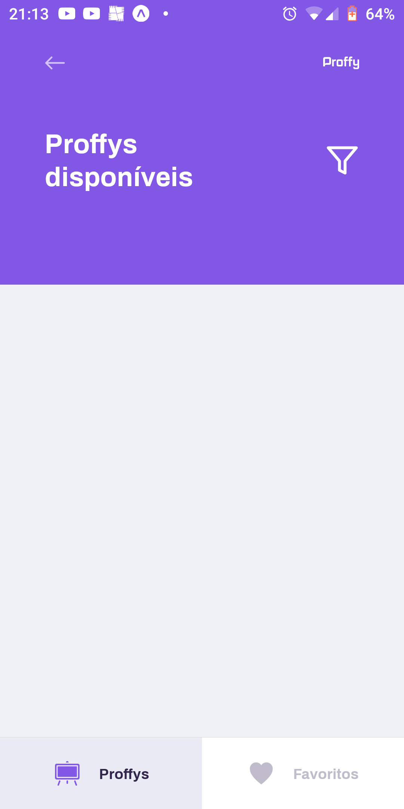

# Projeto Proffy 1.0.
## Next Level Week #2. :computer: :warning: :iphone:

# Server: :floppy_disk: {

## O backend deste projeto concentra-se em armazenar as informações dos professores em um banco de dados. As informações armazenadas são:

### Sobre o professor: Nome, biografia, whatsapp, url do avatar (imagem do professor).

### Em relação à aula: Matéria, custo da aula, dia da semana e horário.
## Sobre a arquitetura do projeto server:

## A pasta do controller contém os comandos, em formato de Class, responsáveis por armazenar as informações do professor e da aula no banco de dados:

## ClassesController.ts:

###  O método index é usado para pesquisar professores por tempo e assunto. O usuário irá digitar o nome da disciplina, o dia da semana e o horário, então o método irá pesquisar se existe um professor que corresponde a esta solicitação, caso haja mais de um esse método retorna um array contendo os professores. 

### Create é o método responsável por criar a turma e o professor além de salvar as informações no banco de dados. Ele recebe o nome, url_avatar, whatsapp, bio, subject, cost, schedule no corpo da requisição.

## ConnectionsController.ts:

### O método index verifica quantas conexões ele possui no banco de dados e retorna o valor no formato JSON.

### Create é o método atualiza as conexões feitas.

## A pasta database contém tudo sobre o banco de dados:
### A pasta migrations contém os arquivos que criam as tabelas do banco de dados e o arquivo connection.ts faz a conexão do sistema ao SQLite. database.sqlite é o banco de dados...

## A pasta utils contém o arquivo que faz a conversão de horas para minutos.

# }

# Web: :computer: {

#### Landing page da aplicação.

# Explicação:

## Este aplicativo visa facilitar a interação aluno-professor, onde o aluno pode procurar um professor apenas por disciplina, dia da semana e horário. Para que isso aconteça, o professor só precisa se cadastrar.
## Na Landing page o usuário verá dois botões, Estudar e Dar aula. O botão Estudar irá guiar o usuário para a página da lista de professores e o botão Dar Aula irá direcionar o professor para se registrar. 

## Na página de inscrição o professor colocará as principais informações:

### Nome.
### Disciplina.
### Url_avatar.
### Número do Whatsapp.
### Biografia.
### Dia da semana e horários das aulas.

## Depois de fazer o registro o professor será direcionado para a Landing page.

## O botão Ensinar turma direciona o usuário para a página TeacherList. Esta página é utilizada para buscar professores e apresentá-los como uma lista de cards, onde esse card contém informações sobre este professor e sua turma. As informações são: 

### Nome.
### Disciplina.
### Imagem do profissional.
### Biografia.
### Valor das aulas.
### Botão para contato via Whatsapp.

# Informações sobre a arquitetura: 

## A pasta assets contém as imagens do projeto.
## A pasta de components contém os principais componentes do projeto, baseados na componentização do ReactJs.
## Input é o componente que foi feito para deixar a estética das entradas do projeto como padrão, evitando assim a repetição de uma mesma linha de código.
## PageHeader é o header padronizado das páginas de registro e listagem. A diferença entre eles é a adição de outro componente, na página de listagem o PageHeader recebe os Inputs e Selects.
## TeacherItem é o cards do professor que apresenta ao usuário as informações do professor.
## A pasta services contém o arquivo que conecta o Site à API.

# }

# Mobile: :iphone: {

# Explicação:

## A versão móvel tem a mesma função que a versão Web, mas possui algumas limitações. Uma das principais limitações é a tela de cadastro, a versão mobile não tem a função de cadastrar a turma dos professores. Existe esse botão, mas o usuário é direcionado para uma tela que tem um botão que leva à página de cadastro na versão web.

## Para compensar a falta de cadastro, a versão mobile possui a funcionalidade de marcar um professor.

## Quando um usuário pressiona o botão Estudar, ele é direcionado para a tela que contém as funções principais. A tela Proffy, é responsável por fazer as pesquisas dos professores. Para fazer a pesquisa o usuário irá colocar as informações do filtro, da mesma forma que acontece na versão Web.

# }
